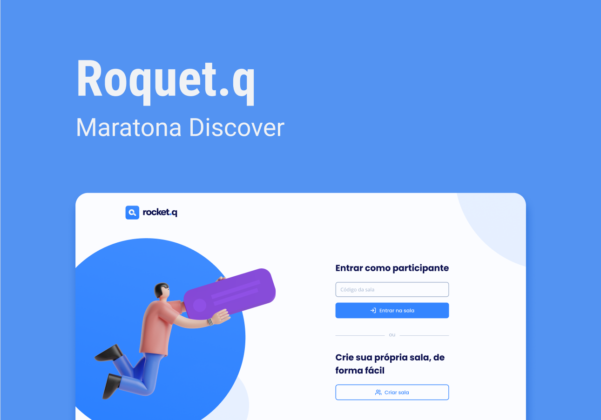

<h1 align="center">
    Rocket.Q
</h1>


<p align="center">
  <a href="#tecnologias">Tecnologias</a>&nbsp; • &nbsp;
  <a href="#projeto">Projeto</a>&nbsp; • &nbsp;
  <a href="#layout">Layout</a>&nbsp; • &nbsp;
  <a href="#testar">Testar</a>
</p>

<br>

<p align="center">
  
</p>

## 🚀 Tecnologias

Esse projeto foi desenvolvido com as seguintes tecnologias:

- HTML
- CSS
- JavaScript
- NodeJS
- EJS
- Express
- SQLite

## 💻 Projeto

O Rocket.Q é uma aplicação de interação através de perguntas, sendo possível criar uma sala para internautas anônimos fazerem perguntas e o criador da sala em posse de uma senha gerenciar essas perguntas e marcar como lidas.

## 🔖 Layout

O layout apresentado no projeto está disponível através [desse link](https://www.figma.com/file/vp3iFfd1ohCbHyDX9jCiQi/Roquet.q). O mesmo foi desenvoldido na plataforma Figma, sendo recomendado ter uma conta para visualizar melhor o layout.

## ✔️ Teste
Para testar a aplicação é necessário realizar os seguintes passos no terminal:

```bash
git clone https://github.com/faffonso/Rocket.Q.git
cd Rocket.Q
npm install
npm start
```

Após essa linha de código o repositório e todas suas dependências seram instaladas e será possível acessar a aplicação através da url `localhost:3000`.

---
Desenvolvido por Francisco Affonso 🖤

Projeto da NLW#6 RocketSeat (Discover)
